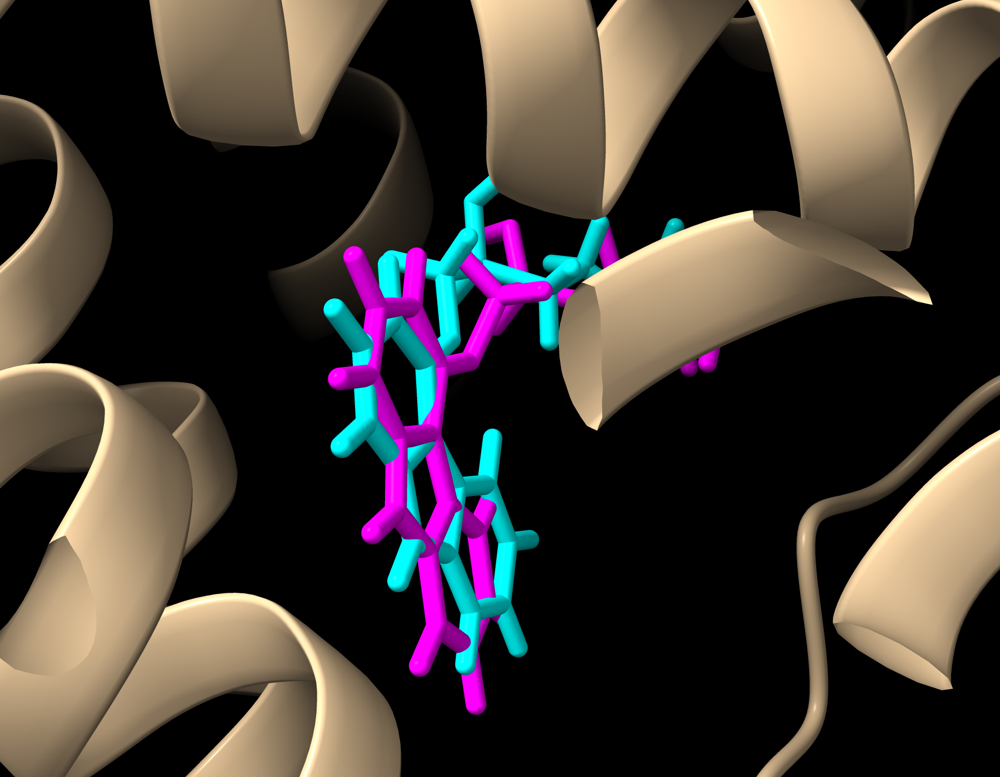

# Carazolol Redocking Validation in the β2-Adrenergic Receptor (PDB 2RH1)
## Overview

* This project validates a molecular-docking workflow by redocking the crystallographic ligand carazolol (ligand code: CAU) into the β2-adrenergic receptor structure PDB 2RH1.

* The objective was to determine whether AutoDock Vina could reproduce the experimentally observed ligand-binding pose. Docked poses were compared with the crystallographic ligand using heavy-atom root-mean-square deviation (RMSD).

## Tools
* AutoDock Vina 1.2.7
* RDKit
* UCSF ChimeraX
* Python
* NumPy
* NetworkX

## Docking System
* Receptor: β2-adrenergic receptor
* PDB structure: 2RH1
* Ligand: Carazolol
* Ligand code: CAU
* Docking Parameters
* Grid center: (-30.262, 9.439, 6.943)
* Grid size: 21.390 × 18.353 × 14.183 Å
* Exhaustiveness: 32

## Workflow
* Prepared the 2RH1 receptor structure.
* Extracted and prepared the crystallographic carazolol ligand.
* Generated receptor and ligand PDBQT files.
* Defined a docking box around the native binding site.
* Performed molecular redocking with AutoDock Vina.
* Converted docked poses for structural analysis.
* Calculated heavy-atom RMSD values between the crystallographic and docked poses.
* Visualized the native and redocked ligand conformations in ChimeraX.

## Results

| Pose | Vina Score (kcal/mol) | Heavy-Atom RMSD (Å) |
| ---: | --------------------: | ------------------: |
|    1 |                -9.980 |               1.013 |
|    2 |                -9.411 |               5.725 |
|    3 |                -9.387 |               1.483 |
|    4 |                -8.964 |               6.496 |
|    5 |                -8.924 |               3.634 |
|    6 |                -8.801 |               5.806 |
|    7 |                -8.705 |               2.765 |
|    8 |                -8.688 |               6.467 |
|    9 |                -8.380 |               6.522 |

The top-ranked pose produced a Vina score of **-9.980 kcal/mol** and a heavy-atom RMSD of **1.013 Å** relative to the crystallographic carazolol pose.

Pose 3 also reproduced the experimental binding orientation, with a Vina score of **-9.387 kcal/mol** and an RMSD of **1.483 Å**.

These results support successful reproduction of the crystallographic binding geometry by the redocking workflow.

## Structural Overlay



The crystallographic carazolol pose is shown in cyan, while the top-ranked redocked pose is shown in magenta.

## Reproducing the Docking

After installing AutoDock Vina, run the following command from the repository root:

```bash
vina --receptor receptor/2RH1_receptor.pdbqt \
     --ligand ligand/CAU.pdbqt \
     --config config/2RH1_receptor.box.txt \
     --exhaustiveness 32 \
     --out results/CAU_redocked.pdbqt
```

## Running the RMSD Analysis

Install the required Python packages:

```bash
pip install -r requirements.txt
```

Run the RMSD script from the repository root:

```bash
python scripts/calculate_rmsd.py
```

The script compares the crystallographic ligand with each docked pose and generates:

```text
results/rmsd_results.csv
```

## Repository Structure

```text
2RH1-carazolol-redocking/
├── config/
│   └── 2RH1_receptor.box.txt
├── figures/
│   └── CAU_redocking_overlay.png
├── ligand/
│   ├── CAU_native.pdb
│   ├── CAU.pdbqt
│   └── CAU.sdf
├── receptor/
│   ├── 2RH1_receptor.box.pdb
│   ├── 2RH1_receptor.pdbqt
│   └── 2RH1_receptorH.pdb
├── results/
│   ├── CAU_redocked.pdbqt
│   ├── CAU_redocked.sdf
│   └── redocking_results.txt
├── scripts/
│   └── calculate_rmsd.py
├── requirements.txt
└── README.md
```

## Limitations

* AutoDock Vina scores are computational scoring-function estimates and are not experimentally measured binding affinities.
* This project evaluates one receptor-ligand complex.
* Additional receptor structures and ligands would be needed to evaluate the broader predictive performance of the workflow.
* The calculated RMSD values evaluate pose reproduction and do not independently establish biological activity.

## Author

**Everett Tam**
Molecular and Cellular Biology
California State University, Sacramento
